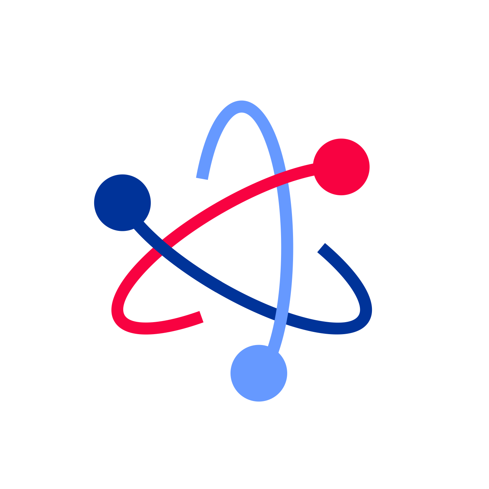

<div style = "font-family: 'Open Sans', sans-serif; font-size: 16px">

# ModuleServo

<div style = "color: #555">
    <p align="center">
    
    </p>
</div>

## Лицензия

<div style = "color: #555">
В разработке
</div>

## Описание
<div style = "color: #555">

Модуль предназначен для прикладной работы с PDW сервоприводами в рамках фреймворка EcoLight и обеспечивает данный функционал:
- Инициализацию и идентификацию различных моделей сервоприводов в соответствии с их характеристиками;
- Управления положением сервопривода, путём поворота его вала на допустимый угол.
Примечание: корректная инициализация модуля в соответствии с характеристиками используемого сервопривода гарантирует, что команды, которые могут навредить прибору, будут отклоняться;
- Хранение информации о текущей позиции сервопривода;
- Перезагрузку актуатора, возвращением его вала в стандартное положение.
Модуль разработан в соответствии с архитектурой актуаторов и является потомком класса [ClassMiddleActuator](https://github.com/Konkery/ModuleActuator/blob/main/README.md).

</div>

## Конструктор
<div style = "color: #555">

Конструктор принимает 1 объект типа **ActuatorOptsType** и 1 объект типа **ActuatorPropsType**.
Пример *_opts* типа [**ActuatorOptsType**](https://github.com/Konkery/ModuleActuator/blob/main/README.md):
```js
let _actuatorProps = {
    name: "FT5519M",
    type: "actuator",
    channelNames: ["angle"],
    typeInSignals: ["digital"],
    quantityChannel: 1,
};

const _opts = {
    pins: [A0],
    minRange: 0,
    maxRange: 180,
    minPulse: 544,
    maxPulse: 2400,
    defaultPos: 0
}

```

Переданные значения далее сохраняются в свойствах модуля, поэтому с их назначением можно ознакомиться ниже.

</div>

### Поля
<div style = "color: #555">

- <mark style="background-color: lightblue">_MinRange</mark> - минимальный угол, на который может поворачиваться вал сервопривода. По-умолчанию равен 0;
- <mark style="background-color: lightblue">_MaxRange</mark> - максимальный угол, который который может занять вал;
- <mark style="background-color: lightblue">_MinPulse</mark> - длина импульса, задающего минимальное положение вала;
- <mark style="background-color: lightblue">_MaxPulse</mark> - длина импульса, задающего максимальное положение вала;
- <mark style="background-color: lightblue">_DefaultPos</mark> - величина в градусах, определяющая стандартное положение вала;
- <mark style="background-color: lightblue">_LastInput</mark> - последнее значение, переданное в метод On(_deg). Внутреннее свойство модуля, не предназначенное для того, чтобы пользователь работал с ним напрямую.
</div>

### Методы
<div style = "color: #555">

- <mark style="background-color: lightblue">On(_deg)</mark> - выполняет поворот вала сервопривода в указанное положение;
- <mark style="background-color: lightblue">Off()</mark> - прекращает удержание угла сервоприводом;
- <mark style="background-color: lightblue">Reset()</mark> - выполняет перезагрузку сервопривода, возвращая его в стандартное положение.
</div>

### Примеры
<div style = "color: #555">
Пример программы для:

```js
//Подключение необходимых модулей
const ClassAppError = require("ModuleAppError.min.js");
const ClassI2CBus   = require("ModuleI2CBus.min.js");
const VL6180 = require("ModuleVL6180.min.js");
const NumIs  = require("ModuleAppMath.min.js");
     NumIs.is();

//Создание I2C шины
let I2Cbus = new ClassI2CBus();
let _bus = I2Cbus.AddBus({sda: P5, scl: P4, bitrate: 100000}).IDbus;

//Настройка передаваемых объектов
let opts = { bus: _bus, pins: [P5, P4], address: 0x29 };
let sensor_props = {
    quantityChannel: 2,
    name: "VL6180",
    type: "sensor",
    channelNames: ['light', 'range'],
    typeInSignal: "analog",
    typeOutSignal: "digital",
    busType: ["i2c"],
    manufacturingData: {
        IDManufacturing: [                  
            { "Adafruit": "4328435534" }    
        ],
        IDsupplier: [                     
            { "Adafruit": "4328435534" }    
        ],
        HelpSens: "VL6180 ambience and range sensor"
    }
};
//Создание объекта класса
let vl6180 = new VL6180(opts, sensor_props);

//Создание каналов и их использование
const ch0 = vl6180.GetChannel(0);
const ch1 = vl6180.GetChannel(1);
ch0.Start();
ch1.Start();

setInterval(() => {
  console.log(ch0.Value + "lux");
  console.log(ch1.Value + "mm");
}, 1000);
```
Результат выполнения:
<div align='center'>
    
</div>

</div>

### Зависимости
<div style = "color: #555">

- <mark style="background-color: lightblue">[ModuleActuator](https://github.com/Konkery/ModuleActuator/blob/main/README.md)</mark>
- <mark style="background-color: lightblue">[ClassAppError](https://github.com/Konkery/ModuleAppError/blob/main/README.md)</mark>
</div>

</div>
